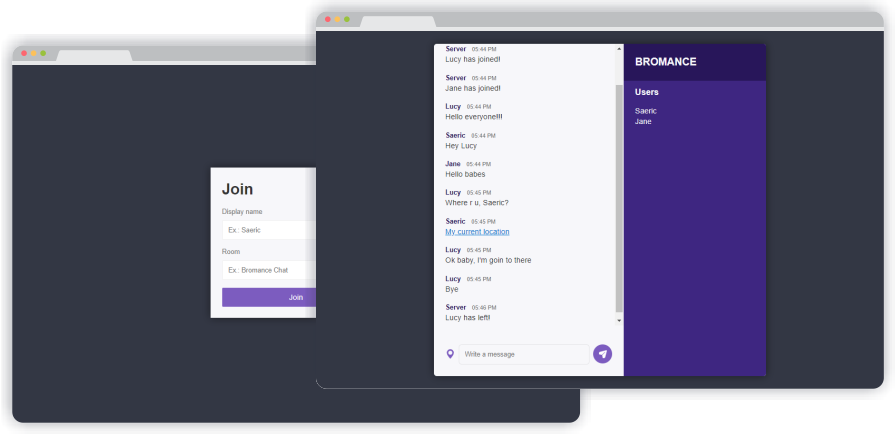

<h1 align="center">Chat App</h1>
 
## Sobre  

Instant messages app de salas desenvolvido com WebSockets com visual e uso simples. 

## Tecnologias  

Criado com:  

- [x] **Node.js** 
- [x] **Socket io**   
- [x] **HTML**  
- [x] **CSS**
  

## Resultados  
<p align="center"></p>

## Execute a aplicação  

```sh  
#Instale as dependências  
$ npm install  
  
#Inicie a aplicação  
$ npm start  
```  

A aplicação vai está rodando em [http://localhost:3000](http://localhost:3000)  
  

## License  

Esse projeto está sob a licença MIT. Veja o arquivo [LICENSE](https://github.com/iranadryan/chat-app/blob/master/LICENSE.md) para mais detalhes.